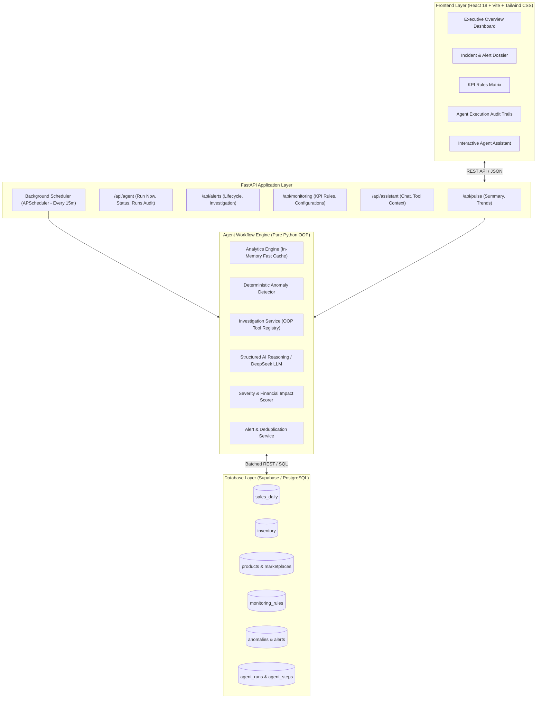
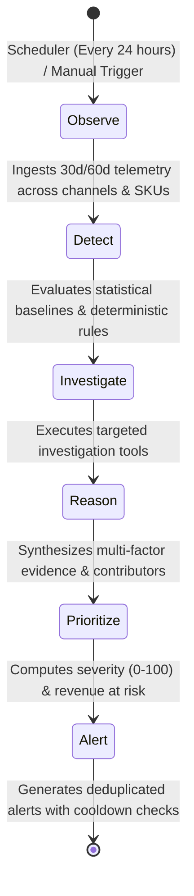
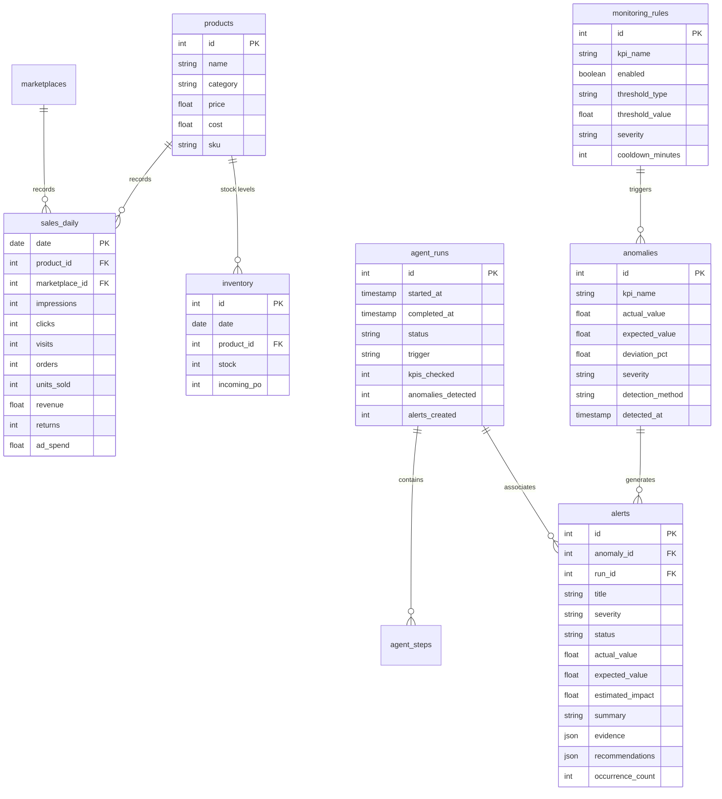

# Business Pulse Agent

> **Autonomous KPI Monitoring, Deterministic Anomaly Detection, and AI-Driven Investigation Platform for Multi-Channel E-Commerce.**

---

## 1. Executive Summary

Modern e-commerce and retail marketplace operations generate thousands of telemetry observations daily across channels (Amazon, Myntra, Flipkart, Ajio), SKU catalogs, ad spend, and warehouse inventory.

Traditional static dashboards force operations managers to manually scan dozens of charts and guess why performance dropped. The **Business Pulse Agent** transforms operations from reactive monitoring to **autonomous detection and investigation**:
- **Continuously monitors** 8 commercial, customer, and supply-chain KPIs.
- **Applies deterministic anomaly detection** (rolling baselines, z-score statistical models, compound signals) with zero hallucinations.
- **Autonomously executes investigation tools** to isolate root-cause contributors and estimate financial exposure.
- **Generates prioritized, deduplicated business alerts** with actionable operational steps.
- **Provides an interactive Agent Assistant** for conversational deep-dives into detected anomalies and audit trails.

---

## 2. System Architecture



---

## 3. Autonomous 6-Stage Execution Lifecycle

Every monitoring cycle (whether triggered automatically by the background scheduler or on-demand via **"Run Agent Now"**) runs through a 6-stage lifecycle:



1. **Observe**: Ingests point-in-time and rolling sales, traffic, conversion, returns, and inventory telemetry.
2. **Detect**: Evaluates metrics against historical 30-day moving baselines, statistical z-scores, and compound signals (e.g. *Traffic Steady + Conversion Drop*).
3. **Investigate**: Dispatches OOP investigation tools (`get_product_contributors`, `get_marketplace_performance`, `get_conversion_anomalies`, `estimate_revenue_impact`).
4. **Reason**: Synthesizes multi-factor diagnostics and identifies likely root-cause contributors.
5. **Prioritize**: Scores anomaly severity and calculates monetary exposure (revenue at risk).
6. **Alert**: Creates or updates business incident alerts, enforcing deduplication and alert cooldown rules (120 mins).

---

## 4. Key Features

- **Continuous KPI Health Monitor**: Tracks Revenue, Orders, Conversion Rate, Return Rate, Average Order Value (AOV), Inventory Days, Sales Velocity, and Revenue at Risk.
- **Zero-Hallucination Deterministic Detection**: Threshold breaches and z-score calculations are executed purely in Python math—never hallucinated by LLMs.
- **AI-Powered Diagnostics & Root-Cause Synthesis**: LLMs are used for evidence synthesis, contributor attribution, and operational recommendations.
- **Incident & Alert Dossier**: 100% dynamic incident detail view showing observed vs expected metrics, variance, supply chain buffer status, diagnostics, and prioritized operational action plans.
- **End-to-End Audit Trail**: Every run logs its steps, start/end timestamps, duration in milliseconds, and raw tool payloads.
- **In-Memory Analytical Caching**: Process-level caching with TTL reduces dashboard load latency from **40s to < 1s** across 15,000+ historical rows.
- **Interactive Agent Assistant**: Conversational modal allowing operators to query the agent regarding active alerts, run steps, and telemetry.

---

## 5. Technology Stack

### Backend
- **Python 3.11+**
- **uv**: Ultra-fast Python package and virtual environment manager.
- **FastAPI**: Asynchronous REST API framework.
- **Supabase / PostgreSQL**: Cloud relational database.
- **APScheduler**: In-process background scheduler.
- **Pandas & NumPy**: High-performance analytical aggregations and rolling baselines.
- **Pydantic v2**: Strict schema validation.

### Frontend
- **React 18** (SPA)
- **Vite**: Frontend build tool and development server.
- **Tailwind CSS**: Modern, high-contrast monochrome and slate executive theme.
- **Recharts**: Responsive timeseries and baseline anomaly visualizers.
- **Lucide React**: Modern iconography.
- **React Markdown & Remark GFM**: Markdown rendering for agent responses.

---

## 6. Getting Started

### Prerequisites
- **Node.js 18+** & **npm**
- **uv** (Install via `curl -LsSf https://astral.sh/uv/install.sh` or `brew install uv`)

---

### Backend Setup

1. Navigate to the `backend/` directory:
   ```bash
   cd backend
   ```

2. Sync dependencies using `uv`:
   ```bash
   uv sync
   ```

3. Configure your `.env` file:
   ```bash
   cp .env.example .env
   ```
   *Fill in your `SUPABASE_URL`, `SUPABASE_KEY`, `DATABASE_URL`, and `LLM_API_KEY`.*

4. Start the FastAPI backend server:
   ```bash
   uv run uvicorn app.main:app --host 0.0.0.0 --port 8000 --reload
   ```

---

### Frontend Setup

1. Navigate to the `frontend/` directory:
   ```bash
   cd frontend
   ```

2. Install dependencies:
   ```bash
   npm install
   ```

3. Start the Vite development server:
   ```bash
   npm run dev
   ```

4. Open **`http://localhost:5173`** in your browser.

---

## 7. API Reference

| Method | Endpoint | Description |
|---|---|---|
| `GET` | `/api/pulse/summary` | Snapshot of business KPIs, growth percentages, and alert counters |
| `GET` | `/api/pulse/trend?days=30` | 30-day historical revenue telemetry timeseries |
| `GET` | `/api/monitoring/kpis` | Monitored KPI health statuses and threshold boundaries |
| `GET` | `/api/monitoring/rules` | Configurable deterministic monitoring rules matrix |
| `PATCH` | `/api/monitoring/rules/{id}` | Update rule threshold values, severity, or toggle ON/OFF |
| `GET` | `/api/alerts` | Filterable list of business alerts (by severity, status, channel) |
| `GET` | `/api/alerts/{id}` | Full incident dossier with evidence, diagnostics, and action plan |
| `PATCH` | `/api/alerts/{id}/status` | Update alert lifecycle state (`New`, `Investigating`, `Acknowledged`, `Resolved`, `Dismissed`) |
| `GET` | `/api/agent/status` | Current scheduler state, interval, and next run timestamp |
| `POST` | `/api/agent/run` | Triggers an immediate full 6-stage autonomous monitoring cycle |
| `GET` | `/api/agent/runs` | Execution history of all past agent cycles |
| `GET` | `/api/agent/runs/{id}` | Step-by-step audit trace with tool calls and duration metadata |
| `POST` | `/api/assistant/chat` | Interactive agent assistant conversation endpoint |

---

## 8. Database Schema Overview

